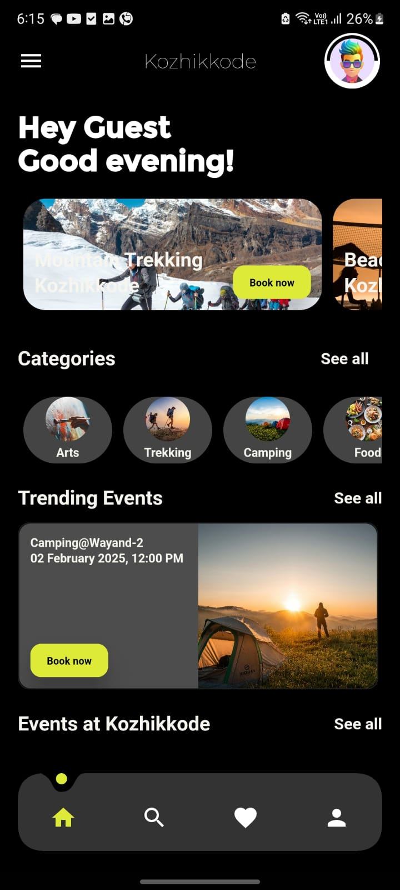
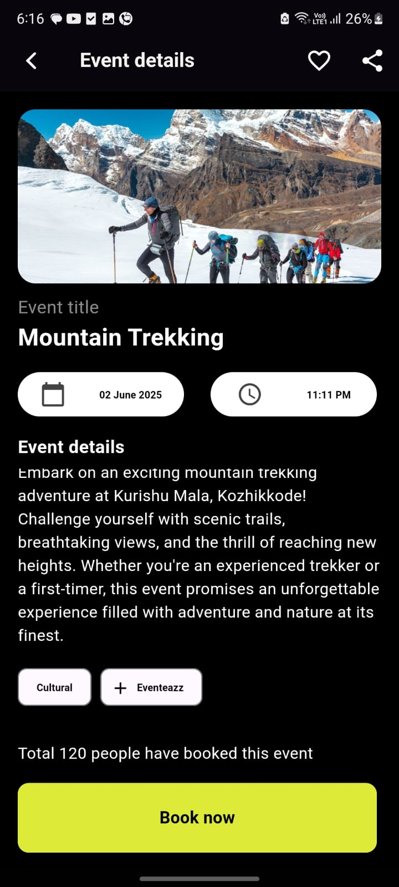
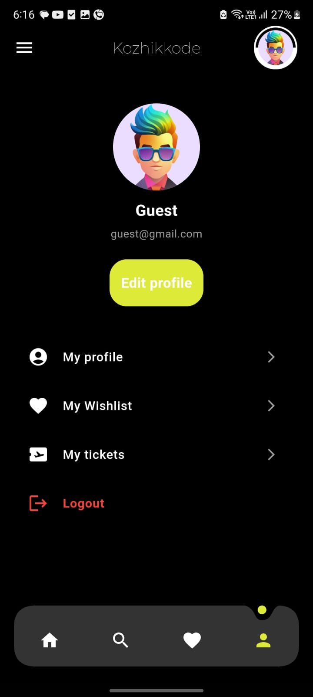
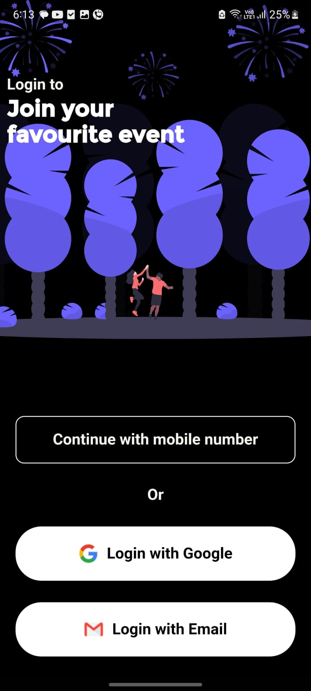
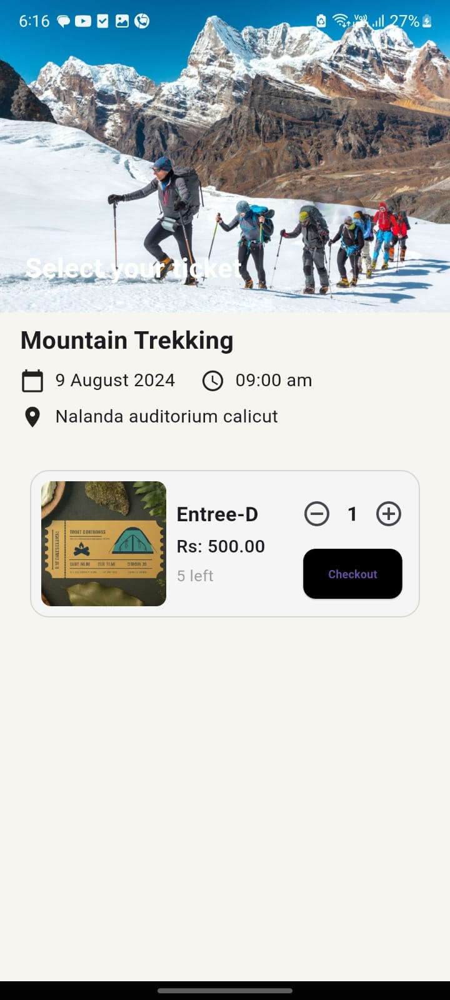

# Event Booking App

## Overview

A Flutter-based event booking application designed to provide users with a smooth and enjoyable experience for browsing, booking, and managing events. 
This cross-platform app delivers a user-friendly interface with well-organized categories, trending events, and easy navigation. 
The app supports multiple authentication methods and offers features like event favoriting, search functionality, and pagination for a seamless user experience.

## Features

- **User Authentication**:
  - Implemented JWT token-based authentication.
  - Supports multiple authentication types:
    - Phone OTP authentication.
    - Email OTP authentication.
    - Google authentication.
  
- **API Interaction**:
  - Utilized the **Dio** package for making REST API calls.
  - Pagination support for efficiently loading large event lists.

- **State Management**:
  - Managed application state using the **BLoC** pattern.
  
- **Reactive Programming**:
  - Utilized the **dart_either** package for handling results and errors in a more functional programming style.

- **Singleton Design Principle**:
  - Ensured efficient and consistent data handling using the Singleton design pattern.

- **Data Caching**:
  - Used **Hive** for local data storage and managing favorited events.

- **Search Functionality**:
  - Implemented a robust search feature for users to find events quickly.

## UI Screenshots

| Home Screen | Categories |
|:-----------:|:----------:|
|  |  |

| Event Details | User Profile |
|:-------------:|:------------:|
|  |  |

| Onboarding | Select Auth Type | Request OTP |
|:----------:|:---------------:|:-----------:|
|  |  |  |

| Verify OTP | Select Ticket Type | Category Page |
|:----------:|:------------------:|:-------------:|
|  |  |  |


## Technologies Used

- **Flutter** for building the cross-platform user interface.
- **Dart** for programming logic and functionality.
- **BLoC** for state management and handling complex application states.
- **Dio** for API requests and handling network connections.
- **SQLite** for local storage and offline data caching.
- **Hive** for storing favorite events locally.
- **JWT (JSON Web Tokens)** for secure authentication.
- **dart_either** for reactive programming and managing results and errors.
- **Singleton Pattern** to ensure data consistency across the app.

## Installation

To run this project locally:

1. Clone the repository:
   ```bash
   git clone https://github.com/your-username/event-booking-app.git
   ```
2. Navigate to the project directory:
   ```bash
   cd event-booking-app
   ```
3. Install dependencies:
   ```bash
   flutter pub get
   ```
4. Run the project:
   ```bash
   flutter run
   ```

## Project Structure

```
lib/
│
├── blocs/                 # BLoC files for managing state
├── data/                  # Interaction with APIs and databases
├── models/                # Model classes
├── repositories/          # Repository classes for handling data
├── resources/             # Resources including constants and API URLs
├── utils/                 # Utility functions (including Singleton implementations)
├── view/                  # UI screens for the app
└── widgets/               # Reusable widgets

```

## API Endpoints

- **GET /events** - Retrieves the list of available events with pagination.
- **POST /bookings** - Books a selected event for the user.
- **GET /categories** - Fetches the list of event categories.
- **POST /auth/phone-otp** - Phone OTP-based authentication.
- **POST /auth/email-otp** - Email OTP-based authentication.
- **POST /auth/google** - Google authentication.

## Pagination

Pagination is implemented for event listings, allowing users to load more data seamlessly as they scroll. This improves app performance by loading data in chunks rather than all at once.

## Search Functionality

A fully functional search feature is included, enabling users to search for events by name

## Contributions

Feel free to fork the repository and submit pull requests. Contributions are welcome!
